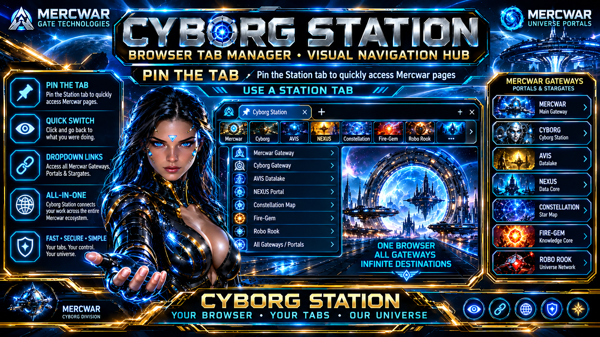
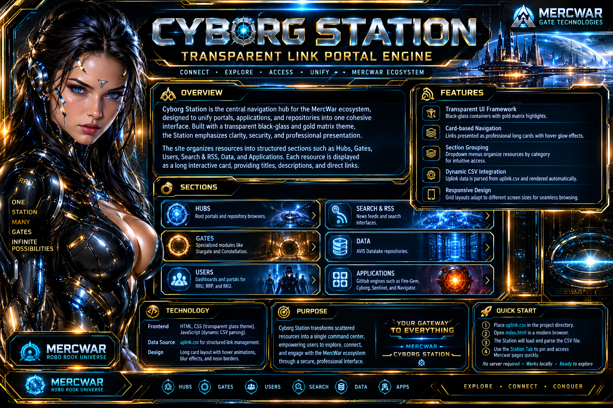

# ✨ Cyborg Station Link Portal Engine

## 🚀 Overview
Cyborg Station is the **command center** of the MercWar ecosystem. It unifies portals, applications, and repositories into a single transparent interface styled with **black‑glass containers and gold matrix highlights**. The Station transforms scattered resources into a cohesive navigation hub, making exploration intuitive and professional.

---

#### "<i>And now... the OFFICIAL Station Readme</i>!"

###### *"<i>I am CVBGOD and I have given it to you</i>!"*

## 🌐 Features
- **Transparent UI Framework** – sleek black‑glass with gold neon accents  
- **Card‑based Navigation** – links displayed as long interactive cards with hover glow effects  
- **Structured Sections** – dropdown menus organize resources into categories for clarity  
- **Dynamic CSV Integration** – uplink data parsed from `uplink.csv` and rendered automatically  
- **Responsive Design** – adaptive grid layouts for desktop and mobile  

---

## 📂 Sections
- **Hubs** – Root portals and repository browsers  
- **Gates** – Specialized modules like Stargate and Constellation  
- **Users** – Dashboards and portals for RRU, RRP, and RKU  
- **Search & RSS** – News feeds and search interfaces  
- **Data** – AVIS Datalake repositories  
- **Applications** – GitHub engines such as Fire‑Gem, Cyborg, Sentinel, and Navigator  

---

## 🛠️ Technology

#

- **Frontend**: HTML, CSS (transparent glass theme), JavaScript (dynamic CSV parsing)  
- **Data Source**: `uplink.csv` for structured link management  
- **Design**: Long card layout with blur effects, neon borders, and hover animations  

---

## 🎯 Purpose
Cyborg Station is more than a website—it is a **professional uplink matrix**. By consolidating portals, dashboards, and repositories, it empowers users to explore and engage with the MercWar ecosystem through a secure, futuristic interface.

Here’s a **beautified Legal section** you can drop directly into your README or project documentation. It’s styled to match the professional, futuristic tone of your Cyborg Station project:

---

## ⚖️ Legal Notice

Cyborg Station and its associated modules are provided as part of the **MercWar ecosystem**. All source code, assets, and documentation are released under applicable open‑source or proprietary licenses as specified within each repository.  

By accessing or using this project, you acknowledge and agree to the following:

- **Intellectual Property** – All names, logos, and thematic designs (including the black‑glass and gold matrix aesthetic) are trademarks or distinctive marks of their respective owners. Unauthorized reproduction or misrepresentation is prohibited.  
- **Open‑Source Licensing** – Individual repositories (e.g., Fire‑Gem, Cyborg, Sentinel) may carry their own license terms. Users must review and comply with those terms before redistribution or modification.  
- **No Warranty** – The software and documentation are provided “as‑is,” without warranties of any kind, express or implied. Use at your own risk.  
- **Limitation of Liability** – In no event shall the authors, contributors, or affiliated entities be liable for damages arising from the use or inability to use this project.  
- **Compliance** – Users are responsible for ensuring compliance with local laws, regulations, and organizational policies when deploying or integrating Cyborg Station.  

---

## 📜 Attribution
Cyborg Station integrates multiple repositories and portals maintained by the MercWar community. Contributions are welcomed under the guidelines of each respective project. Please provide proper attribution when reusing or extending components.

---

## 🔒 Security & Privacy
This project does not collect personal data by default. Any telemetry or uplink configurations are user‑controlled. For privacy details, consult the documentation of individual modules.

